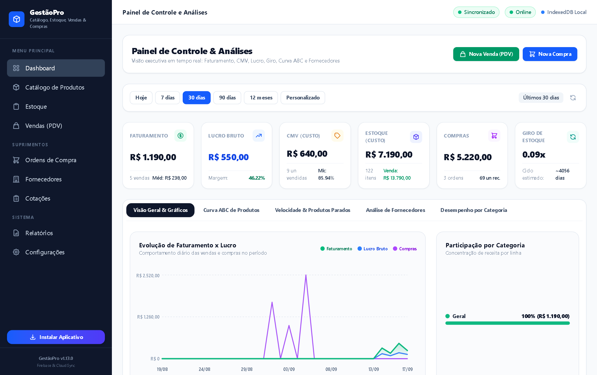
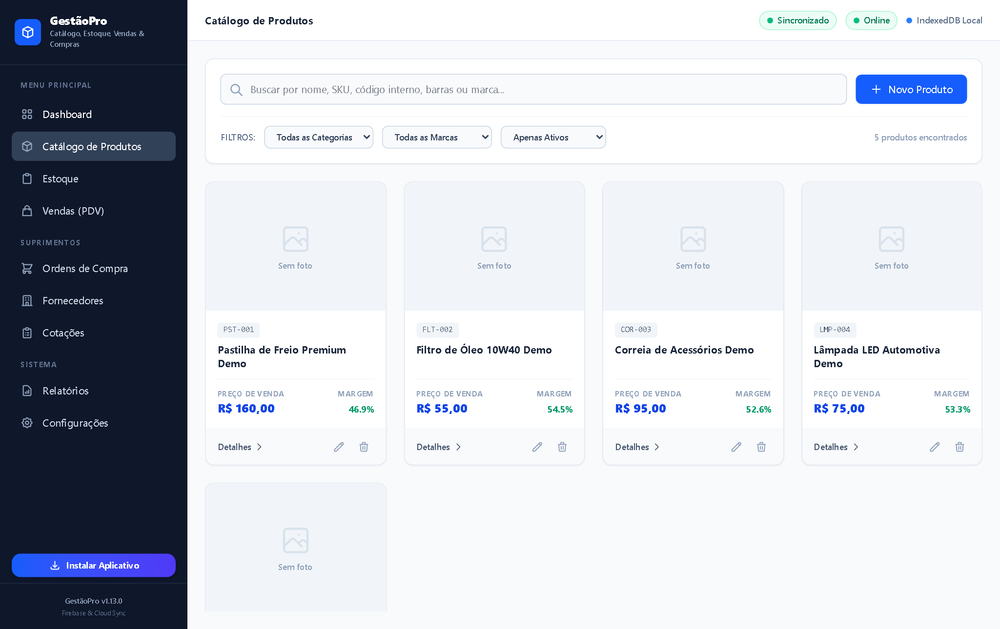
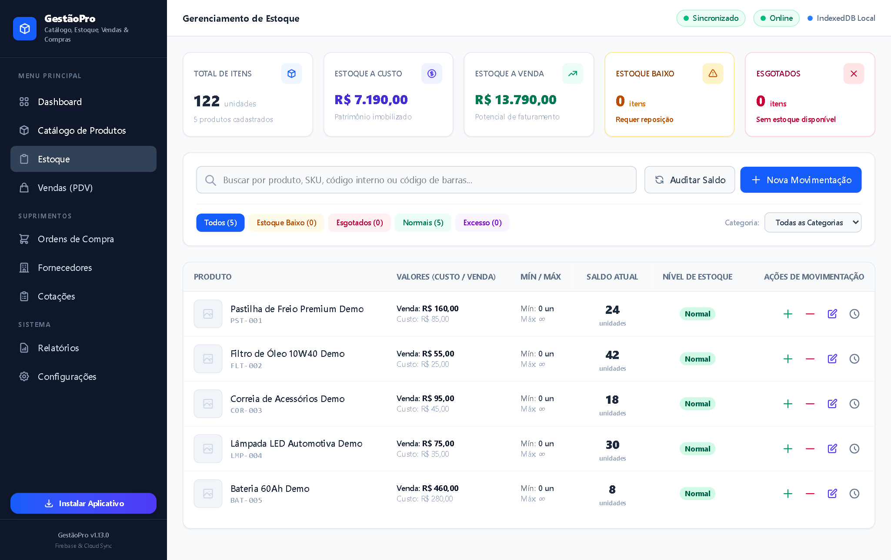
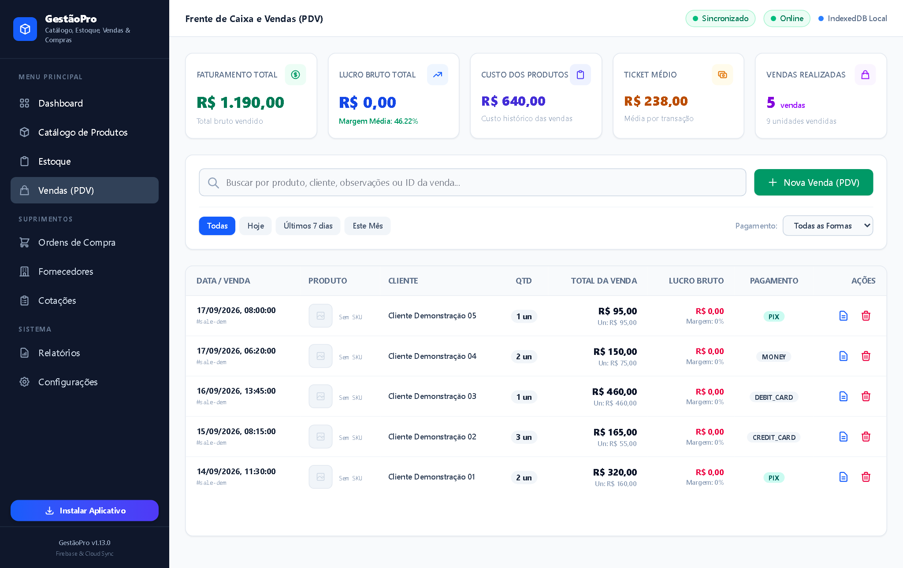
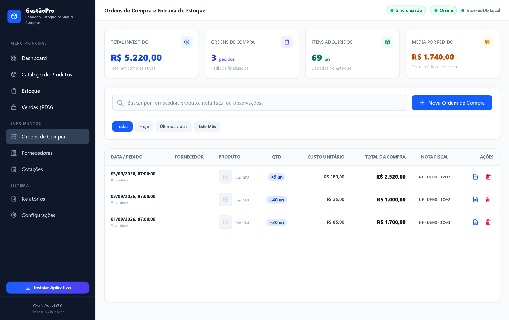
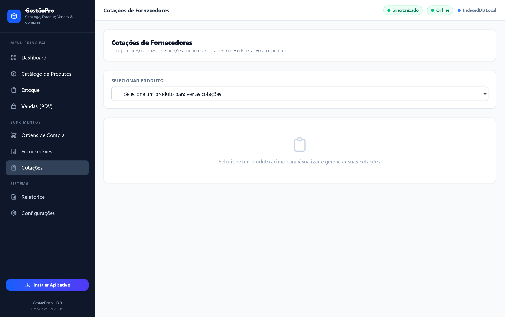
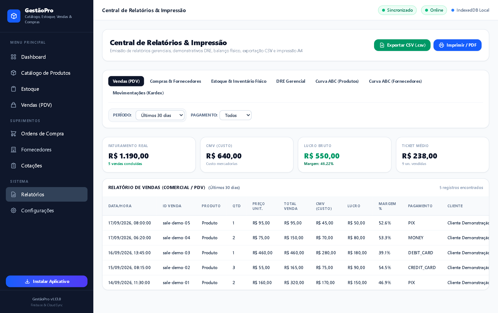
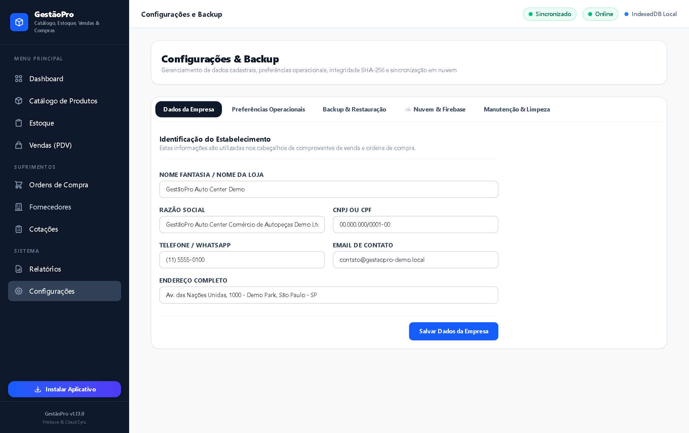

```text
┌─────────────────────────────────────────────────────────────┐
│                          GestãoPro                          │
│          ERP Offline-First / PWA / Tauri Desktop            │
└─────────────────────────────────────────────────────────────┘
```

# GestãoPro — Sistema de Gestão Comercial & Controle de Estoque

[](https://github.com/wallacextreme/gerenciador-de-produtos/actions/workflows/deploy-pages.yml)
[](https://wallacextreme.github.io/gerenciador-de-produtos/)
[](tests/)
[](public/sw.js)
[](src-tauri/)
[](src/js/db/)
[](RELATORIO_QUALIDADE_ISO25010.md)
[](SISTEMA_GESTAO_QUALIDADE_ISO9001.md)

---

## 🚀 Demonstração Online

Acesse a demonstração interativa em produção no GitHub Pages:

👉 **[https://wallacextreme.github.io/gerenciador-de-produtos/](https://wallacextreme.github.io/gerenciador-de-produtos/)**

> [!NOTE]
> **Modo Demonstração Pública**: A versão online é executada exclusivamente com um **dataset sintético de autopeças** e persistência local no navegador via IndexedDB. Não há conexão com servidores privados ou bancos de dados reais. Toda a manipulação de vendas, compras e relatórios permanece isolada no dispositivo do usuário.

---

## 📸 Screenshots do Sistema

Capturas reais da interface executada sob o dataset sintético de demonstração:

| 01. Dashboard Analítico | 02. Catálogo de Produtos |
| :---: | :---: |
|  |  |
| **03. Controle de Estoque** | **04. Ponto de Venda (PDV)** |
|  |  |
| **05. Ordens de Compra** | **06. Comparativo de Cotações** |
|  |  |
| **07. Relatórios & Auditoria** | **08. Configurações & Backup SHA-256** |
|  |  |

---

## 🧠 Sobre o Projeto

O **GestãoPro** é um sistema completo de gestão comercial e controle de estoque desenvolvido sob o paradigma **Offline-First**, projetado para pequenos e médios estabelecimentos comerciais (com foco prático em centros automotivos e autopeças).

Diferente de sistemas web tradicionais que dependem continuamente de conectividade à internet para registrar vendas ou consultar estoques, o GestãoPro opera com **autonomia local total**:

- **Operação ininterrupta**: Vendas no PDV, baixas e conferências de estoque continuam funcionando normalmente mesmo durante quedas completas de sinal ou internet;
- **Persistência transacional atômica**: Transações multi-store no IndexedDB previnem corrupção de dados entre vendas e estoque;
- **Distribuição híbrida unificada**: O mesmo código-fonte web é distribuído tanto como **Progressive Web App (PWA)** instalável no navegador quanto como **aplicativo nativo para Windows** via Tauri v2 e Rust.

---

## 🏗️ Arquitetura do Sistema

O projeto adota uma arquitetura em camadas estritamente desacopladas (*Ports & Adapters / Clean Architecture*):

```text
┌─────────────────────────────────────────────────────────────────────────┐
│                                 USUÁRIO                                 │
└────────────────────────────────────┬────────────────────────────────────┘
                                     │
                 ┌───────────────────┴───────────────────┐
                 ▼                                       ▼
    ┌─────────────────────────┐             ┌─────────────────────────┐
    │     Navegador / PWA     │             │  Desktop Windows Nativo │
    │  (Service Worker + SW)  │             │   (Tauri v2 IPC / Rust) │
    └────────────┬────────────┘             └────────────┬────────────┘
                 │                                       │
                 └───────────────────┬───────────────────┘
                                     ▼
┌─────────────────────────────────────────────────────────────────────────┐
│                    CAMADA DE APRESENTAÇÃO (UI / UX)                     │
│  - Router SPA Hash (navegação instantânea sem reload de página)         │
│  - EventBus Desacoplado (pub/sub de eventos do ciclo de vida)           │
│  - Design System Modular com Tailwind CSS v4                            │
│  - Telas: Dashboard, Produtos, Estoque, PDV, Compras, Cotações, etc.    │
└────────────────────────────────────┬────────────────────────────────────┘
                                     ▼
┌─────────────────────────────────────────────────────────────────────────┐
│                      CAMADA DE SERVIÇOS & DOMÍNIO                       │
│  - Regras de Negócio: ProductService, StockService, SaleService         │
│  - Precisão Financeira em Centavos Inteiros: MoneyService               │
│  - Margens Líquidas e Markups: MarginService                            │
│  - Validadores Puros de Dados: ProductValidator, SaleValidator, etc.    │
└────────────────────────────────────┬────────────────────────────────────┘
                                     ▼
┌─────────────────────────────────────────────────────────────────────────┐
│                          CAMADA DE REPOSITÓRIOS                         │
│  - BaseRepository Pattern com operações CRUD assíncronas                │
│  - Repositórios especializados: Product, StockMovement, Sale, Supplier  │
│  - Consultas indexadas com múltiplos filtros em memória e cursor        │
└──────────────────┬──────────────────────────────────┬───────────────────┘
                   ▼                                  ▼
┌─────────────────────────────────────┐  ┌────────────────────────────────┐
│       PERSISTÊNCIA LOCAL            │  │     SINCRONIZAÇÃO EM NUVEM     │
│  - IndexedDB nativo via `idb 8.0`   │  │  - SyncEngine (Outbox Queue)   │
│  - Migrations de Esquema            │  │  - Last-Write-Wins (LWW)       │
│  - Transações Atômicas Multi-Store  │  │  - MockCloudProvider (Memória) │
│  - Backup JSON com Hash SHA-256     │  │  - FirebaseProvider (REST API) │
└─────────────────────────────────────┘  └────────────────────────────────┘
```

---

## 📴 Offline-First & Resiliência

1. **Service Worker Estruturado (`public/sw.js`)**:
   - Estratégia **Network-First** com fallback instantâneo para o shell local em navegações;
   - Estratégia **Cache-First** para assets estáticos com hash imutável gerados pelo Vite (`/assets/*`);
   - Ciclo de vida com detecção de novas versões e aviso amigável ao usuário (`pwa:update-ready`).
2. **Armazenamento Persistente**:
   - Solicitação automática de `navigator.storage.persist()` para garantir que o navegador não purgue os registros do IndexedDB sob pressão de armazenamento.

---

## 🗃️ Persistência de Dados & Integridade Transacional

- **Banco de Dados IndexedDB Versionado**: O esquema possui 10 object stores estruturadas em `src/js/db/migrations.js`:
  - `products`, `productImages`, `suppliers`, `productSuppliers`, `sales`, `purchases`, `stockMovements`, `categories`, `settings` e `syncQueue`.
- **Cálculos Financeiros em Centavos Inteiros**: Para evitar anomalias de ponto flutuante da especificação IEEE 754, todas as grandezas monetárias são calculadas e armazenadas em centavos inteiros (`MoneyService`).
- **Backup e Restauração com Hash SHA-256**: O `BackupService` exporta o estado do banco em formato JSON com hash de integridade SHA-256 calculado via **Web Crypto API**. Na importação, o arquivo passa por validação estrita, snapshot pré-restauração e inserção atômica com rollback automático em caso de falha.

---

## ☁️ Motor de Sincronização Desacoplado (Outbox Pattern)

O sistema conta com um motor de sincronização em nuvem assíncrono e resiliente (`SyncEngine`):

- **Fila Outbox**: Todas as mutações locais são registradas em uma fila de eventos pendentes antes de serem transmitidas;
- **Resolução de Conflitos**: Mecanismo determinístico *Last-Write-Wins (LWW)* baseado em carimbos temporais ISO 8601;
- **Provedores Suportados**:
  - `MockCloudProvider`: Provedor em memória ideal para testes automatizados e demonstração pública sem consumo de APIs externas;
  - `FirebaseProvider`: Adaptador que consome a REST API do Google Firestore diretamente via `fetch`, sem a necessidade de dependências pesadas do SDK no cliente.

---

## 🖥️ Desktop Nativo (Tauri v2 + Rust)

Para ambientes de frente de caixa corporativos em estações Windows, o GestãoPro é compilado com **Tauri v2**:

- **Consumo de Memória Reduzido**: Menos de 40 MB de RAM em repouso (significativamente inferior ao consumo médio de aplicações Electron);
- **Instaladores Compactos Prontos para Distribuição**:
  - Instalador Windows NSIS (`.exe`): **2.32 MB**
  - Pacote Corporativo Windows Installer (`.msi`): **3.32 MB**
  - Binário executável isolado (`gestaopro.exe`): **9.04 MB**
- **Menor Privilégio**: As permissões de IPC do Tauri são delimitadas estritamente ao conjunto mínimo `core:default`.

---

## 📱 PWA & Experiência Mobile

- Manifesto W3C compatível (`public/manifest.json`) com modo `display: standalone`;
- Ícones responsivos para dispositivos móveis e desktops (96x96 a 512x512 com suporte a *maskable*);
- Atalhos rápidos na tela inicial para Dashboard, PDV e Estoque;
- Banner não intrusivo para instalação e notificação de status offline em tempo real.

---

## 🧪 Testes Automatizados

O repositório possui uma ampla suíte de testes de unidade e integração executada no runner nativo do **Bun**:

```bash
bun test
```

### Resultados da Execução Auditada no Ambiente:

```text
14 arquivos de teste executados
171 testes executados
168 testes aprovados com sucesso
3 testes reprovados (verificação pontual de versão em platform_phase12)
Tempo de execução: 923 ms (< 1 segundo)
```

Os testes abrangem: cálculos de markup e margem líquida, regras financeiras, migrações do IndexedDB, movimentações de estoque, validação de transações de venda, fornecedores, cotações comparativas, relatórios analíticos, rotinas de backup criptográfico e provedores de sincronização.

---

## 📊 Avaliação de Qualidade de Software (ISO/IEC 25010:2023)

O projeto foi submetido a uma auditoria técnica documental completa, estruturada no modelo da **ISO/IEC 25010:2023** (*Product Quality Model*), cobrindo suas 9 características:

1. **Adequação Funcional** (*Functional Suitability*)
2. **Eficiência de Desempenho** (*Performance Efficiency*)
3. **Compatibilidade** (*Compatibility*)
4. **Capacidade de Interação** (*Interaction Capability*)
5. **Confiabilidade** (*Reliability*)
6. **Segurança** (*Security*)
7. **Manutenibilidade** (*Maintainability*)
8. **Flexibilidade** (*Flexibility*)
9. **Segurança Operacional** (*Safety*)

Consulte o relatório completo em: **[`RELATORIO_QUALIDADE_ISO25010.md`](RELATORIO_QUALIDADE_ISO25010.md)**.

> [!NOTE]
> O relatório representa uma avaliação técnica e análise de aderência (*gap analysis*) documental baseada nas evidências do repositório, não constituindo certificação emitida por organismo credenciado.

---

## 🏛️ Sistema de Gestão da Qualidade (ISO 9001:2026)

O ciclo de vida de desenvolvimento, governança e melhoria contínua do projeto é documentado em alinhamento com a norma **ISO 9001:2026** (edição publicada em 16/09/2026), incluindo:

- Mapeamento das Cláusulas 4 a 10 (Estrutura Harmonizada / *Annex SL*);
- Procedimentos Operacionais Padrão (POP 01 a POP 05) cobrindo controle documental, desenvolvimento modular, testes de regressão, geração de releases e gestão de não conformidades;
- Matriz de Riscos Operacionais e Registro de Oportunidades Técnicas.

Consulte a documentação completa em: **[`SISTEMA_GESTAO_QUALIDADE_ISO9001.md`](SISTEMA_GESTAO_QUALIDADE_ISO9001.md)**.

---

## 📖 Documentação Técnica Completa

Para aprofundamento técnico, consulte os documentos presentes no repositório:

- 📘 **[Manual do Usuário](MANUAL_DO_USUARIO.md)**: Guia operacional completo com fluxo de instalação, telas do sistema, procedimentos passo a passo e resolução de problemas comuns.
- 📐 **[Estudo de Caso para Portfólio](docs/PORTFOLIO_CASE_STUDY.md)**: Análise detalhada das decisões arquiteturais, desafios técnicos e resultados de engenharia.
- 📊 **[Relatório de Qualidade de Produto (ISO/IEC 25010:2023)](RELATORIO_QUALIDADE_ISO25010.md)**: Auditoria técnica baseada em evidências rastreáveis do código.
- 🏛️ **[Sistema de Gestão da Qualidade (ISO 9001:2026)](SISTEMA_GESTAO_QUALIDADE_ISO9001.md)**: Governança de processos, POPs e matrizes de risco.
- 🔒 **[Política de Segurança](SECURITY.md)**: Diretrizes de divulgação responsável de vulnerabilidades e isolamento do ambiente público.

---

## 🔐 Segurança & Governança de Dados

- **Dados 100% Fictícios**: Nenhuma informação empresarial confidencial, cliente real, fornecedor real, CPF/CNPJ real ou registro financeiro é publicado no repositório ou no build público;
- **Zero Segredos Versionados**: Credenciais, chaves privadas, service accounts e tokens de APIs estão excluídos e protegidos pelo `.gitignore`;
- **Modo Demo Seguro**: O build disponibilizado no GitHub Pages inicializa com o dataset sintético de autopeças e utiliza o `MockCloudProvider`, impedindo conexões acidentais com serviços de produção.

---

## 🛠️ Stack Tecnológica

| Camada | Tecnologias Utilizadas |
| :--- | :--- |
| **Runtime & Test Runner** | [Bun v1.3](https://bun.sh/) (alta performance de execução e testes) |
| **Frontend Core** | HTML5 Semântico, Vanilla JavaScript (ESNext, Web Components / Modular) |
| **Build Tool & Bundler** | [Vite v8.2](https://vitejs.dev/) |
| **Estilização & UI** | [Tailwind CSS v4.3](https://tailwindcss.com/) com design system responsivo |
| **Persistência Local** | [IndexedDB API](https://developer.mozilla.org/pt-BR/docs/Web/API/IndexedDB_API) via [idb v8.0](https://github.com/jakearchibald/idb) |
| **PWA & Offline Shell** | Service Worker nativo, Cache API, W3C Web App Manifest |
| **Desktop Runtime** | [Tauri v2.11](https://tauri.app/) + [Rust](https://www.rust-lang.org/) |
| **CI / CD** | GitHub Actions (`deploy-pages.yml`) |

---

## ▶️ Execução Local

### Pré-requisitos
- **Bun** instalado ([bun.sh](https://bun.sh/)) ou Node.js 18+;
- (Opcional, para compilar a versão desktop): Rust e build tools da plataforma.

### 1. Clonar o repositório
```bash
git clone https://github.com/wallacextreme/gerenciador-de-produtos.git
cd gerenciador-de-produtos
```

### 2. Instalar dependências
```bash
bun install
```

### 3. Executar em modo desenvolvimento (Web/PWA)
```bash
bun run dev
```
A aplicação estará acessível em `http://localhost:3000`.

### 4. Executar em modo Desktop nativo (Tauri)
```bash
bun run tauri dev
```

### 5. Executar suíte de testes automatizados
```bash
bun test
```

---

## 📦 Build e Publicação

### Gerar build de produção Web
```bash
bun run build
```
Os arquivos otimizados serão gerados no diretório `dist/`.

### Gerar build público para o GitHub Pages
```bash
GITHUB_PAGES=true VITE_PUBLIC_DEMO=true bun run build
```

### Gerar instaladores executáveis Desktop Windows (Tauri)
```bash
bun run tauri build
```
Os instaladores `.exe` (NSIS) e `.msi` serão gerados em `src-tauri/target/release/bundle/`.

---

## 📚 Documentação & Engenharia

| Documento | Descrição |
| :--- | :--- |
| 📖 **[Estudo de Caso de Engenharia (Case Study)](docs/PORTFOLIO_CASE_STUDY.md)** | Decisões técnicas, desafios de arquitetura, benchmarks e métricas. |
| 💼 **[Guia para LinkedIn e Currículo](docs/CURRICULO_E_LINKEDIN.md)** | Textos prontos para destaque no perfil, posts e tópicos de CV (STAR). |
| 📘 **[Manual do Usuário](MANUAL_DO_USUARIO.md)** | Manual operacional de uso de todos os módulos do ERP. |
| 📊 **[Relatório de Qualidade ISO/IEC 25010](RELATORIO_QUALIDADE_ISO25010.md)** | Avaliação técnica segundo as 9 características do modelo de produto. |
| 📋 **[Sistema de Gestão da Qualidade ISO 9001](SISTEMA_GESTAO_QUALIDADE_ISO9001.md)** | Governança de processos e rastreabilidade técnica. |
| 🛡️ **[Política de Segurança (SECURITY.md)](SECURITY.md)** | Modelo de ameaças e canal de reporte responsável. |

---

## 📄 Licença

Este projeto é disponibilizado para fins de estudo, demonstração técnica e avaliação de portfólio profissional. Todos os direitos reservados ao autor.

---

## 👨‍💻 Autor

Desenvolvido por **[Wallace Soares](https://github.com/wallacextreme)**.

Projeto voltado à demonstração de competências de engenharia de software, arquitetura Offline-First, desenvolvimento PWA/Desktop e garantia de qualidade.